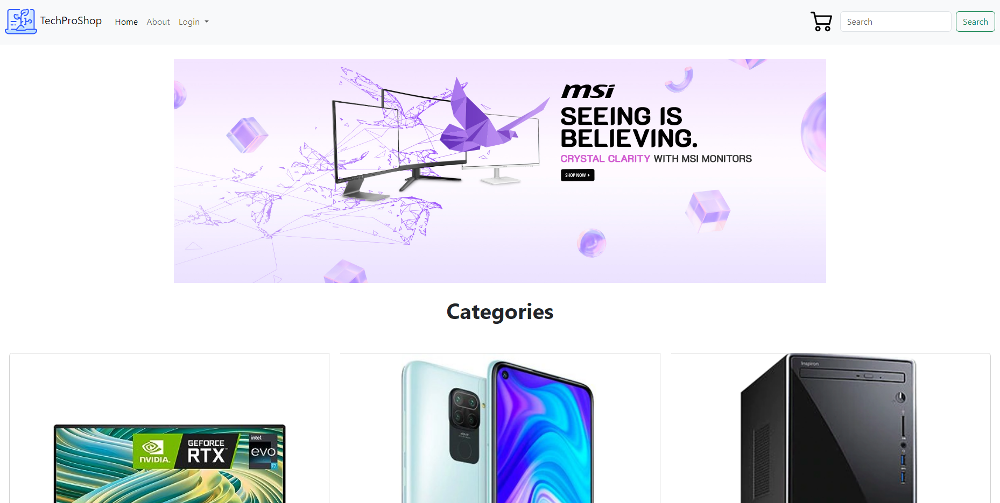
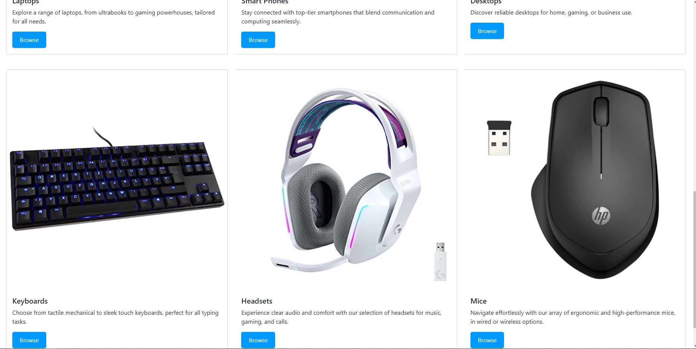
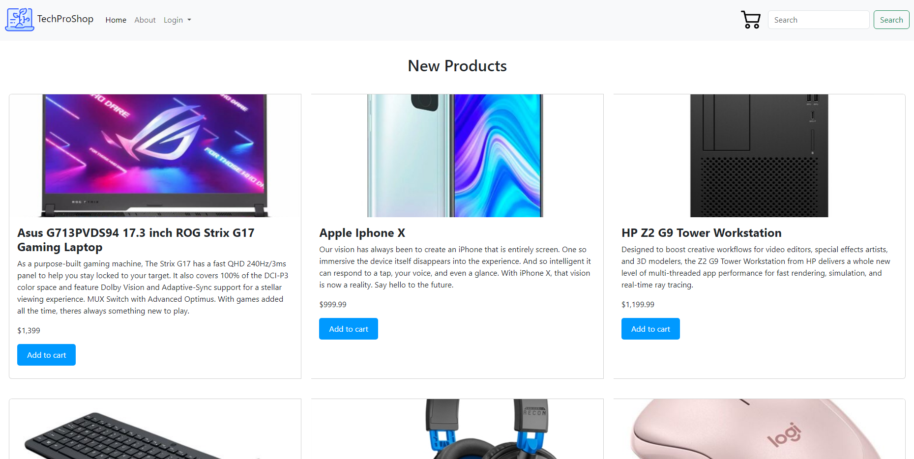
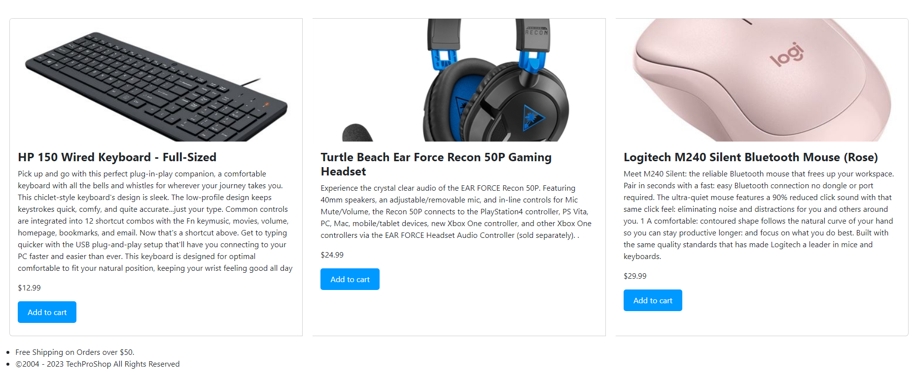
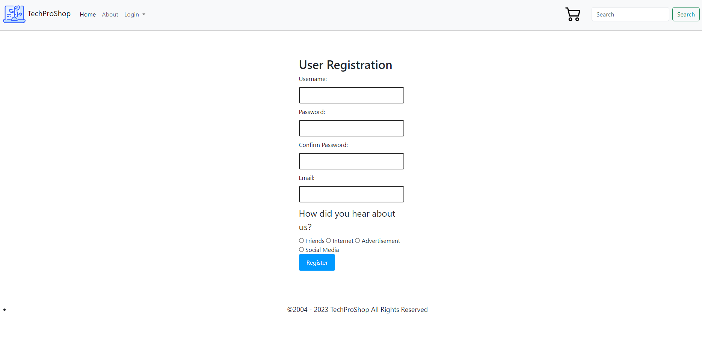
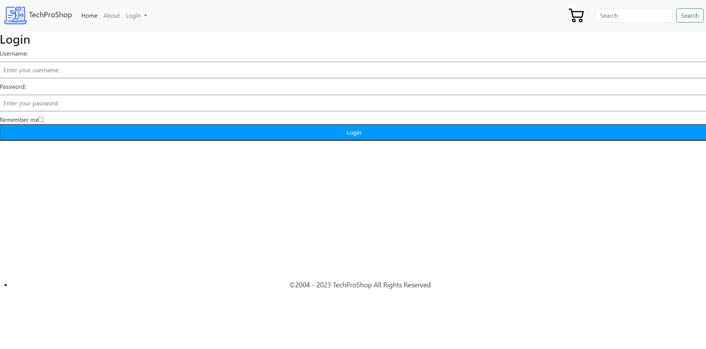
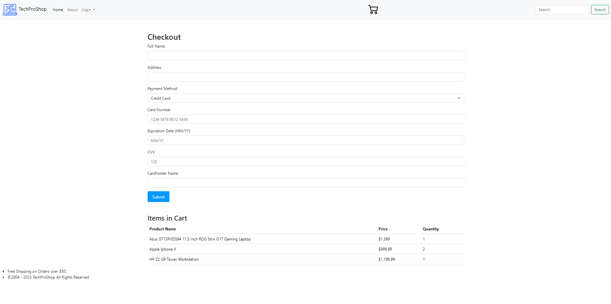

# Mock E-Commerce Site

## Overview:
TechProShop is designed to be a mock up of a technology based e-commerce site to show off elements of HTML, CSS, and Bootstrap.

## User Interaction:
Visitors can navigate through the website through the action buttons on the navigation bar and throughout the page.

## Content Display:
The website showcases different uses of Bootstrap to style.

